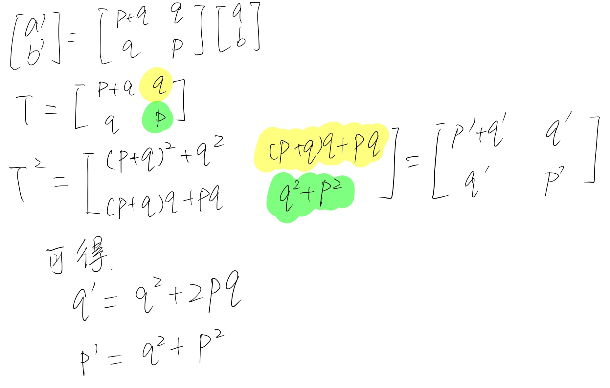

# 习题解答 1.19

三次变换中的数，分别用a,b,a',b',a'',b''来表示

可知

a' = bq+aq+ap

b' = bp+aq

a'' = b'q+a'q+a'p

b'' = b'p+a'q

其中

b'' = b'p+a'q=(bp+aq)p + (bq+aq+ap)q = b(pp+qq) + a(2pq+qq)

所以

p' = pp+qq
q' = 2pq+qq

可以把p'和q'带入a''进行验算，可知其正确性。

--------

