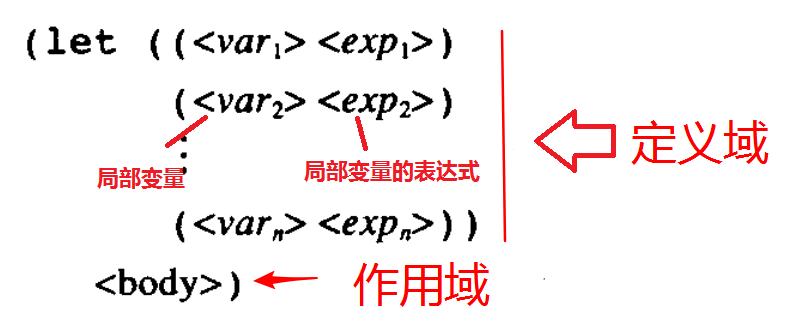

# 用高阶函数做抽象

## 高阶过程
以过程为参数，或者以过程为返回值。

## let

由上图可知，let的结构是

`(let (<局部变量> <局部变量表达式> ……) <作用域>)`
let中变量的作用域范围是
1. 局部变量**仅在**作用域中起作用
1. 局部变量表达式中的变量，是let结构体外的变量。

```racket
#lang racket
(define x 5)

(+ (let (( x 3)) ;;定义局部变量x = 3
     (+ x (* x 10))) ;; 局部变量在其作用域起作用，所以，这一行的计算结果为33
   x) ;;这已是let外，此时x = 5
;; 整体的计算结果是 38

(let ((x 3) ;;定义局部变量 x = 3
      (y ( + x 2))) ;;定义局部变量 y = x + 2，局部变量表达式中的 x 应该是全局变量中的x = 5，所以， y = 7
  (* x y)) ;;这里是let作用域，所以，x，y都是局部变量，结果是21
```