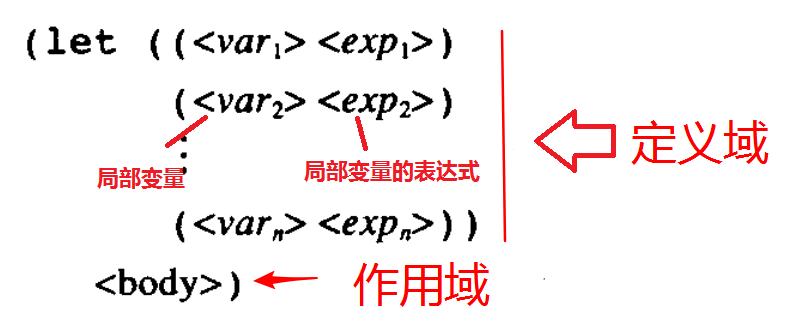

# 第 1 章 构造过程抽象

本章讲的是有关计算过程的知识。

计算过程是对数据的操作。

选用 Lisp 来描述计算过程，因为计算过程的 Lisp 描述本身又可以作为 Lisp 的数据来表示和操作。

## 1.1 程序设计的基本元素

设计程序，就是设计`数据`和`过程`的交互方式。**注意**， 同一个单元，既可以是`数据`，也可以是`过程`。当 Ta 被操作时， Ta 是`数据`；当 Ta 去操作别的单元时， Ta 是`过程`。

强有力程序语言的三种机制

1. 基本表达形式： 基础数据结构和基础操作方法
1. 组合的方法： 把基本元素进行构造和复合，形成复杂元素的方法。
1. 抽象的方法： 为复合对象命名，并把他们当作单元去操作。

```racket
;表达式
2
;表达式的组合
(* 2 2)
;表达式的抽象
(define x 2)
;表达式的进一步抽象
(define y (* x x))
y
;定义过程，是一种更强大的抽象过程。
;用(square x)来代表(* x x)的过程。x可以是任何数据。
(define (square x) (* x x))
（square 5)
```

以上的代码中，

- x 是对整数变量的抽象，此时， X 恰好等于 2 而已。
- y 是对整数变量的平方的抽象，此时，y 因为 x=2，而恰好等于 4 而已。
- (square x)是一个复合过程，此过程的名称是 square，参数是 x ，具体过程是（* x x）

## 1.2 过程与它们所产生的计算

- 递归：先展开再收缩
- 迭代：存在保存状态变化的量

### 关于换硬币例子的思考

有一美元想要换成硬币，硬币有 5 种，分别是 1、 5、 10、 25、 50 美分。问一共有多少种不同的换法？
现在分析如下，总数应该等于

1. 100-10=90 美分，用 5 种硬币的换法数，加上
1. 100 美分，用除了 10 美分外的 4 种硬币的换法数

以上划分方法，是对换钱方式的一个**划分**，划分的标准是：换出的零钱中，是否包含 10 美分。划分后的子集

1. 减少了钱数
1. 减少了硬币的种数

要求就是说，子集简化了全集。同时，子集还可以按照全集的划分方法，继续划分下去

1. 100-10=90 美分，用 5 种硬币的换法数，等于
    1. 90-10=80 美分，用 5 种硬币的换法数，加上
    1. 90 美分，用除了 10 美分外的 4 种硬币的换法数
1. 100 美分，用除了 10 美分外的 4 种硬币的换法数，等于
    1. 100-5=95 美分，用除了 10 美分外的 4 种硬币的换法数，加上
    1. 100 美分，用除了 10 美分和 5 美分外的 3 种硬币的换法数

但是，子集的划分不可能无限继续下去。很快就会遇到以下终止条件。

1. 0 美分需要换零钱，显然，这个划分路径已经找到了一种可行的换法，应该返回 1
1. <0 美分需要换零钱，显然，这个划分路径前面减多了，这不是一种可行的换法，应该返回 0
1. 要剩下的 0 种硬币来换零钱，显然，已经没有可供选择的硬币了，这也不是一种可行的换法，应该返回 0

**注意**，以上只是用 10 美分和 5 美分做例子说明，先选哪一种硬币，不影响结果。因为，最后计算的是组合数。你可以修改[count-change.rkt](./count-change.rkt)中的(define (first-denomenation kinds-of-coins)的 cond 内容，来观察结果是否一致。

### 关于递归的终结

1. 递归调用必须有终止条件。
1. 递归调用总是去尝试解决规模更小的子问题，这样递归才能收敛于终止条件。
1. 递归调用的子集必须是对父集的一个划分，不然，就会漏掉或者出现重复的结果。

## 1.3 用高阶函数做抽象

### 高阶过程

以过程为参数，或者以过程为返回值。

### let



由上图可知，let 的结构是

`(let (<局部变量> <局部变量表达式> ……) <作用域>)`

let 中变量的作用域范围是

1. 局部变量**仅在**作用域中起作用
1. 局部变量表达式中的变量，是 let 结构体外的变量。

```racket
#lang racket
(define x 5)

(+ (let (( x 3)) ;;定义局部变量x = 3
     (+ x (* x 10))) ;; 局部变量在其作用域起作用，所以，这一行的计算结果为33
   x) ;;这已是let外，此时x = 5
;; 整体的计算结果是 38

(let ((x 3) ;;定义局部变量 x = 3
      (y ( + x 2))) ;;定义局部变量 y = x + 2，局部变量表达式中的 x 应该是全局变量中的x = 5，所以， y = 7
  (* x y)) ;;这里是let作用域，所以，x，y都是局部变量，结果是21
```
